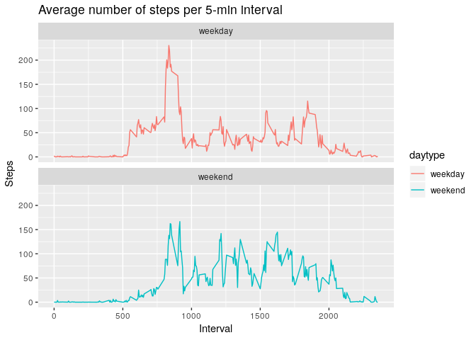

### Introduction

Analysis of a data set containing the number of steps taken
by someone in October and November 2012, in intervals of 5 minutes.
So the dataset contains 61 (days) x 24 (hours) x 12 (5 minutes) = 17568 rows


### Load the data and calculate the total number of steps taken per day


```r
activity <- read.csv("activity.csv", colClasses = c("numeric","Date","numeric"))
total_steps_per_day <- group_by(activity, date) %>% summarise(total = sum(steps, na.rm = FALSE))
```

### Make a histogram of the total number of steps taken each day


```r
p <- ggplot(total_steps_per_day, aes(x = total)) 
p <- p + geom_histogram(fill = "red", binwidth = 1000) 
p <- p + labs(title = "Histogram of daily steps", x = "Number of steps", y = "Frequency") 

print(p)
```

<!-- -->

### Calculate and report the mean and median of the total number of steps taken per day


```r
mean_number_of_steps_per_day <- mean(total_steps_per_day$total, na.rm=TRUE) 
median_number_of_steps_per_day <- median(total_steps_per_day$total, na.rm=TRUE)
```
Mean number of steps per day : 10766.1886792  \
Median number of steps per day : 10765


### Make a time series plot of the 5-minute interval (x-axis) and the average number of steps taken, averaged across all days (y-axis)


```r
average_number <- group_by(activity, interval) %>% summarise(average_steps = mean(steps, na.rm=TRUE))

q <- ggplot(average_number, aes(x = interval , y = average_steps)) 
q <- q +  geom_line(color="blue", size=1) 
q <- q +  labs(title = "Average number of steps per 5-min interval", 
               x = "Interval", 
               y = "Steps")

print(q)
```

<!-- -->

### Which 5-minute interval, on average across all the days in the dataset contains the maximum number of steps?


```r
max_intervals <- filter(average_number, average_steps == max(average_steps))
interval <- max_intervals[1,]$interval
```
It is the 5-minute interval starting at 835

### Calculate and report the total number of missing values in the dataset 

```r
NAs <- sum(is.na(activity$steps))
```
The number of missing values in the steps column is 2304

### Replace NA's in the steps column by the average of the corresponding interval (over 2 months) and write this new dataset to file

```r
activity_cleaned <- activity %>% group_by(interval) %>% 
    mutate(steps = ifelse(is.na(steps), mean(steps,na.rm = TRUE), steps))
write.csv(activity_cleaned,"activity_cleaned.csv",row.names=FALSE)
```

### Based on the new dataset, make a histogram of the total number of steps taken each day and calculate and report the mean and median total number of steps taken per day. Do these values differ from the estimates from the first part of the assignment? What is the impact of imputing missing data on the estimates of the total daily number of steps?


```r
total_steps_per_day <- group_by(activity_cleaned, date) %>% summarise(total = sum(steps, na.rm = TRUE))

r <- ggplot(total_steps_per_day, aes(x = total)) 
r <- r + geom_histogram(fill = "red", binwidth = 1000) 
r <- r + labs(title = "Histogram of daily steps", x = "Steps", y = "Frequency") 

print(r)
```

<!-- -->

```r
mean_number_of_steps_per_day <- mean(total_steps_per_day$total, na.rm=TRUE)
median_number_of_steps_per_day <- median(total_steps_per_day$total, na.rm=TRUE)
```
New mean number of steps per day : 10766.1886792  \
New median number of steps per day : 10766.1886792\
Both values are more or less the same as the previous ones.\
\

### Create a new factor variable in the dataset with two levels – “weekday” and “weekend” indicating whether a given date is a weekday or weekend day


```r
activity_weekday_weekend <- activity_cleaned %>% mutate(daytype = weekdays(date))

activity_weekday_weekend <-
    activity_weekday_weekend %>%
    mutate(daytype = case_when(
        daytype %in% c("maandag","dinsdag","woensdag","donderdag","vrijdag") ~ "weekday", 
        daytype %in% c("zaterdag","zondag") ~ "weekend"))
```

### Make a panel plot containing a time series plot of the 5-minute interval (x-axis) and the average number of steps taken, averaged across all weekday days and weekend days (y-axis).


```r
average_number <- group_by(activity_weekday_weekend, interval, daytype) %>% 
    summarise(average_steps = mean(steps, na.rm=TRUE))

s <- ggplot(average_number, aes(x = interval , y = average_steps, color = daytype)) 
s <- s +  geom_line(size=0.5) 
s <- s +  labs(title = "Average number of steps per 5-min interval", 
               x = "Interval", 
               y = "Steps")
s <- s + facet_wrap(~daytype , ncol = 1, nrow=2)

print(s)
```

<!-- -->
\
There is considerably less activity in the weekend.

